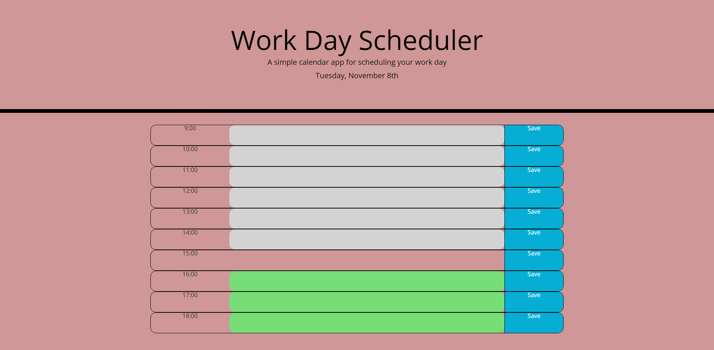

# Challenge 5 Third-Party-APIs
This challange required students to Create a simple calendar application that allows a user to save events for each hour of the day by modifying starter code. This app will run in the browser and feature dynamically updated HTML and CSS powered by jQuery.

The html shows todays date and 9am-6pm in 24hour time and allows the user to input and save values into the local storage.
Contains:
    - HTML
    - CSS
    - JavaScript

Link: https://ryanzade.github.io/Challenge-5/

RyanZade
github link: https://github.com/RyanZade/Challenge-5 